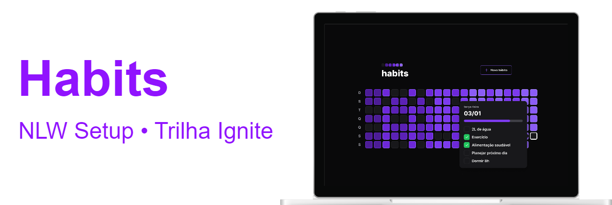
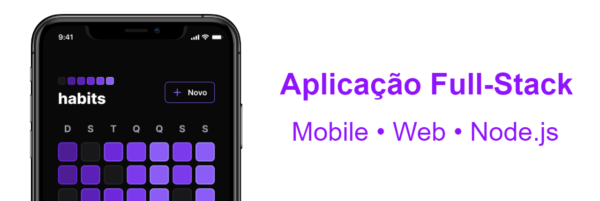

## Sobre

**habits** é um aplicativo projetado para ajudar você a rastrear seus hábitos e melhorar sua qualidade de vida. Com ele, você pode criar uma lista de hábitos que deseja incorporar em sua rotina diária e marcá-los a medida que os pratica.

O aplicativo apresenta um quadro diário que mostra a frequência dos hábitos praticados, permitindo que você veja sua progresso ao longo do tempo e se motive a seguir em frente.



---

## Referência da API

**Obter o resumo dos hábitos**

```bash
GET /summary
```

**Obter os hábitos possíveis referente a uma data**

```bash
GET /day?{date}

# /day/2023-01-20T14:00:00.000Z
```

| Parâmetro | Tipo               | Descrição                   |
| :-------- | :----------------- | :-------------------------- |
| `date`    | `Date (ISOString)` | Data dos possíveis hábitos. |

**Alternar o estado de um hábito específico**

```bash
PATCH /habits/{id}/toggle

# /habits/67961b77-5096-4b1b-96aa-d21bb949172b/toggle
```

| Parâmetro | Tipo            | Descrição                             |
| :-------- | :-------------- | :------------------------------------ |
| `id`      | `string (UUID)` | Id do hábito a ter o estado alternado |

**Criar um hábito**

```bash
POST /habits

# Corpo em JSON
# {
#   "title": "Beber 2L de água",
#   "weekDays": [0, 2, 4]
# }
```

| Chave      | Tipo       | Descrição                                   |
| :--------- | :--------- | :------------------------------------------ |
| `title`    | `string`   | Título do hábito a ser criado               |
| `weekDays` | `number[]` | Array numérico referente aos dias da semana |

## Demonstração da aplicação completa


## Instalação

### Configuração inicial

Clone o repositório e instale as dependências.

```bash
git clone https://github.com/diegoAndrade777/nlw-setup

cd nlw-setup

```
### Back-end

```bash
 cd server
 yarn
 npx prisma migrate dev
 npx prisma studio (para visualizar as tabelas e dados)

```
### Front-end

```bash
 cd web
 yarn dev
```
### Mobile

```bash
 cd mobile
 yarn
 npx expo start
```
Obs: Abrirá automaticamente em `localhost:19002`. Iniciae o emulador ou faça o download do *ExpoGo* na Play Store ou App Store e scaneie o QR Code.

### Modificando o IP local ou porta

Altere de acordo com o seu endereço local, os seguintes arquivos:

- [axios.ts](./web/src/lib/axios.ts) (web)
- [axios.ts](./mobile/src/lib/axios.ts) (mobile)
- [server.ts](./server/src/server.ts) (server)

```diff
# server.ts

- app.listen({ port: 3333, host: "1192.168.1.10" })
+ app.listen({ port: 3333, host: "0.0.0.0" })

# axios.ts

- baseURL: "http://192.168.1.10:3333",
+ baseURL: "http://0.0.0.0:3333",
```

## Licença

[MIT](./LICENSE) &copy; [Rocketseat](https://rocketseat.com.br/)

Made with ♥ by Diego Andrade :wave: [Get in touch!](https://www.linkedin.com/in/diego-rodrigo-de-andrade-98a0271a0/)
